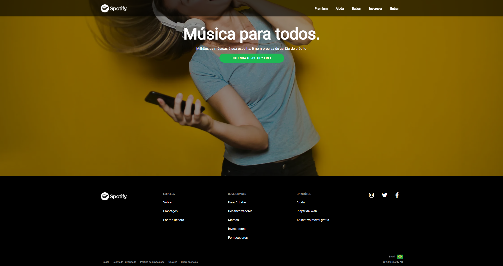

# Simple Spotify Home Page

  

### English 🇺🇸 

<h1 align="center">Introduction</h1>

This was the first project to put knowledge of HTML5 and CSS3 into practice.

A simple project, single page, but under development and will be added other pages, features and integrations.

 
  <h1 align="center"> Project Description </h1>
  Spotify home page implementation. Basic knowledge of HTML5 and CSS3 just learned was used. 
 

 
  <h1 align="center">Future Implementations</h1>
  For future implementations, will be developed:
  <ul> 
    <li> Other pages that make up the home page, such as: Premium, help, about, etc; </li>
    <li> Login and logout authentication system communicating with a backend. </li>
    <li> Refactor the project to use React. </li>
  </ul>
 

<h1 align="center">FeedBack</h1>
Contact me at <a href="https://www.linkedin.com/in/iago-henrique-05b204116/">Linkedin</a> or <a href="https://www.instagram.com/iago_htavares/">Instagram</a>
  
  

### Português 🇧🇷

<h1 align="center"> Introdução </h1>

 Este foi o primeiro projeto para colocar em prática conhecimentos de HTML5 e CSS3. 

Um projeto simples, única página, mas que está em desenvolvimento e será acrescentado outras páginas, funcionalidades e integrações. 

 
  <h1 align="center"> Descrição do Projeto </h1>
  Implementação da página inicial do Spotify. Foi utilizado conhecimentos básicos de HTML5 e CSS3, recém aprendidos. 
 

 
  <h1 align="center"> Implementações Futuras </h1>
  Para implementações futuras, será desenvolvido:
  <ul> 
    <li> Demais paginas quem compõem a home da pagina, como por exemplo: Premium, ajuda, sobre, etc; </li>
    <li> Sistema de autenticação do login e logout fazendo a comunicação com um backend; </li>
    <li> Refatorar o projeto para utilizar React. </li>
  </ul>
 

<h1 align="center"> FeedBack </h1>
Entre em contato comigo pelo  <a href="https://www.linkedin.com/in/iago-henrique-05b204116/">Linkedin</a> ou <a href="https://www.instagram.com/iago_htavares/">Instagram</a>
